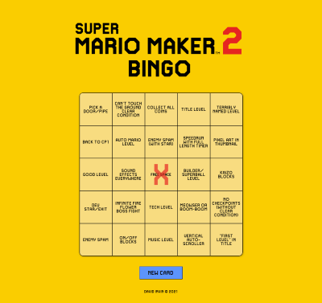
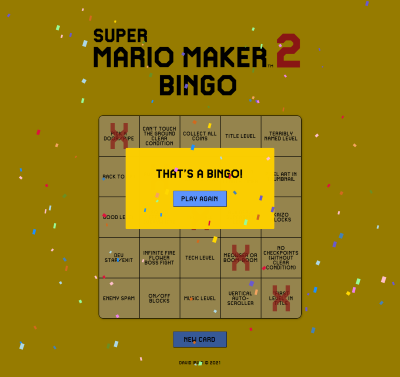

# Bingo Card Generator for Mario Maker 2

A single page site made for a video game streamer to play "bingo" with Mario Maker 2. Landing on the page creates a new card. The cells can be clicked to indicate completion, and once a bingo is reached, the site congratulates you and generates a new card.

### Hosting

This site is currently hosted by github pages at https://psikai.github.io/mario-maker-bingo-card/
